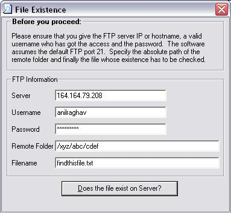



## File Exists on Remote FTP server

### Description

Use this program when you want to check if a file exists on the remote FTP server. I wanted an application similar to this very badly, but, coudln't find one anywhere. So, I decided to write this. This is an extremely simple program without any API, OCX,DLL etc. I assume you can use FTP from the command prompt.

If you like the program, please vote.
 
### More Info
 

             |
---                |---
**Submitted On**   |2004-04-12 02:21:02
**By**             |[Anil Raghav](https://github.com/Planet-Source-Code/PSCIndex/blob/master/ByAuthor/anil-raghav.md)
**Level**          |Beginner
**User Rating**    |4.8 (19 globes from 4 users)
**Compatibility**  |VB 4\.0 \(16\-bit\), VB 4\.0 \(32\-bit\), VB 5\.0, VB 6\.0
**Category**       |[Miscellaneous](https://github.com/Planet-Source-Code/PSCIndex/blob/master/ByCategory/miscellaneous__1-1.md)
**World**          |[Visual Basic](https://github.com/Planet-Source-Code/PSCIndex/blob/master/ByWorld/visual-basic.md)
**Archive File**   |[File\_Exist1732514122004\.zip](https://github.com/Planet-Source-Code/anil-raghav-file-exists-on-remote-ftp-server__1-53082/archive/master.zip)

